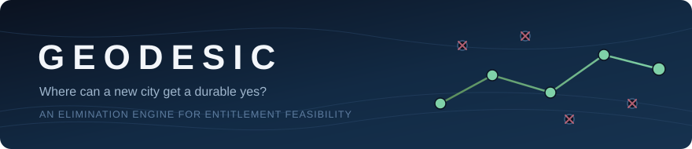
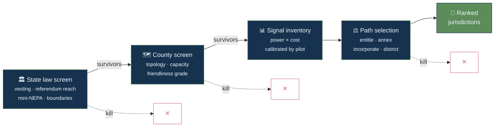

### A framework for finding where a new city can actually get entitled.

Geodesic is a research repo for one question:

> **Where can a master-planned, mixed-use city get a legally durable yes before the project has spent real money?**

This is not a "where is land cheap?" project and not a generic rezoning guide. It is an elimination engine for killing weak jurisdictions early, using state law, county structure, and observable political signals.

Nothing here is legal advice. Every statutory claim stays provisional until local land-use counsel reviews it.

## Why this exists

Most site-selection work starts too late and falls in love with acreage too early.

Geodesic starts one layer up:

- Can this state even create a durable entitlement instrument at this scale?
- Can a county say yes without handing veto power to another body?
- If politics turn hostile later, is the remedy an injunction or just damages?

The core durability standard is the **breach test**:

> If a later actor revokes the instrument, can the project force performance, or only get paid after the damage is done?

That framing is the backbone of the repo. Full context lives in [framework/00-the-question.md](framework/00-the-question.md).

## At a glance

| Area | What it does |
| --- | --- |
| `framework/` | The operating method: question, heuristics, state screen, county screen, signal inventory, entitlement paths |
| `ops/` | Hand-off-ready game plans per step: tasks tagged by execution mode (automated / AI-assisted / human / phone), data-source registry, tooling build triggers |
| `results/` | Applied outputs: state files, county files, scorecard |
| `research/` | Dated research notes and raw supporting material |
| `archive/` | Original draft material preserved for reference |
| [`ROADMAP.md`](ROADMAP.md) | Current execution plan and log |

## The method

Geodesic works as a funnel, not a thesis. Each stage exists to kill candidates cheaply before the next, more expensive stage begins.

The repo is organized to match that sequence:

1. [00 - The Question](framework/00-the-question.md) — what we're actually asking, and the breach test
2. [01 - Heuristics](framework/01-heuristics.md) — kill-rate ordering, infrastructure multiplier, scale thresholds
3. [02 - State Screen](framework/02-state-screen.md) — four statute-readable variables that kill entire states for $0
4. [03 - County Screen](framework/03-county-screen.md) — the phase-gate funnel and county topology
5. [04 - Signal Inventory](framework/04-signal-inventory.md) — every signal scored on power × cost
6. [05 - Entitlement Paths](framework/05-entitlement-paths.md) — the path is a choice variable, not an input
7. [06 - Project Spec](framework/06-project-spec.md) — the envelope being screened for (**the step-0 gate**; currently placeholder numbers — answer before Validate)
8. [07 - Federal Layer](framework/07-federal-layer.md) — §404, ESA, NEPA handles: minimize federal hooks

*(That list is ordered by document; the diagram above is the conceptual funnel. The actual **run-order** is below.)*

## Operating sequence (what you do, in order)

The conceptual funnel becomes this sequence in practice. Each step is a gate: clear it before spending on the next.

0. **⛔ Project spec gate — answer [framework/06](framework/06-project-spec.md) first.** Build-out scale (50k? 400k?), industrial anchor, phasing. It is one conversation and it sets every downstream threshold; every Validate/Commit verdict is *spec-conditional* on it. *(In the pilot this was run last under the pre-pilot "record-don't-eliminate" rule — a deliberate pilot-mode exception, not the live-mode order. See [L21](research/pilot-lessons.md).)*
1. **State screen** ([02](framework/02-state-screen.md)) — four statute-readable variables (vesting · referendum reach · mini-NEPA · boundary commission) + the breach test. Kills whole states for $0.
2. **County phase-gate funnel** ([03](framework/03-county-screen.md)) — run survivors through four stages, cheapest kill first, region-conditional ordering ([01 heuristics](framework/01-heuristics.md)):
   - **Stage 1 — Screen** (~2h): existential physical/regulatory kills (water basin / §404 wetlands / overlays / no assembly path).
   - **Stage 2 — Filter** (~1d): regulatory topology + political capacity (meeting-grade *paired with topology*, [04 signals](framework/04-signal-inventory.md)).
   - **Stage 3 — Validate** (~1wk): physical/economic reality at scale — water, power, land+absorption (labor/housing), geotech.
   - **Stage 4 — Commit** (~1mo): veto-player map, best path + veto stack, option/LOI posture.
3. **Verify + counsel** — convert load-bearing 🔍 Mode-B drafts to ✅ against official primary sources; counsel-review the breach-test/durability claims. *No number is a verdict until this runs.*
4. **Path selection & rank** ([05](framework/05-entitlement-paths.md)) — a county scores as well as its *best* path (county-entitle / annex / incorporate / district), evaluated over (state × county × path). Run the **[Path-0 buy-already-entitled](results/scorecard.md#buy-already-entitled-track)** track in parallel throughout.

Kill-override and "pilot-mode runs every signal as data" modify *when* you act on a kill ([03](framework/03-county-screen.md)); they don't change this order.

## Current posture

| Category | Current state |
| --- | --- |
| Framework | **v1.3 — signal inventory ([04](framework/04-signal-inventory.md)) calibrated through Validate/Commit + Sweetwater Depth 1**; adds overlay topology / contiguous-component testing to prevent aggregate-acreage false passes |
| Stage | Pilot complete through Stage 4 synthesis; Depth 1 underway for Sweetwater |
| Pilot states | Wyoming, South Dakota, North Carolina |
| Pilot counties | Sweetwater County WY, Fall River County SD, Jones County NC |
| Next move | Principal scale/phasing input, principal-facing upgrade/results report, then widen the funnel |
| Automation | Deferred except for proven Tier-A/overlay helpers; build order lives in [ops/step-3](ops/step-3-automation.md) |
| Framework | **v1.1 — signal inventory ([04](framework/04-signal-inventory.md)) calibrated (partial) against the 3-county pilot**; docs 00–03, 05–07 stable. Scale-threshold promoted, transmission demoted, friendliness-grade topology-gated. *Calibration was off a Stage-1 pass; a second pass for the Stage-3/4 lessons (L16–L19) is due.* |
| Stage | **Pilot complete end-to-end** — all 3 counties run through Stage 4. Everything is a 🔍 Mode-B draft pending the verification + counsel pass (see Known limitations). |
| Pilot states | Wyoming, South Dakota, North Carolina |
| Pilot counties | Sweetwater County WY (🟡 survivor), Fall River County SD (🔴 confirmed), Jones County NC (🔴-leaning, scale-dependent) |
| Next move | Get the principal's real project spec ([06](framework/06-project-spec.md)) — the gating unknown for all three verdicts — then run the deferred verification/counsel pass. See [ROADMAP](ROADMAP.md). |
| Automation | Intentionally deferred until the manual pilot proves signal value ("earn the engine") |

See the active plan and full log in [ROADMAP.md](ROADMAP.md).

> **Known limitations (read before trusting any verdict).** Everything in `results/` is a **🔍 Mode-B draft**: AI-assisted, sourced to secondary/finding-aid material, **not yet verified against official primary sources or reviewed by counsel** (one exception: the ✅ WY Title 15 extract). The pilot's Stage-3/4 economics were screened against **placeholder spec numbers** ([06](framework/06-project-spec.md)) — every verdict is explicitly *spec-conditional*. The [Path-0 buy-already-entitled track](results/scorecard.md#buy-already-entitled-track) is unpopulated. This README's posture is the project's *negative* filter result (it cheaply rejects wrong jurisdictions); it has **not** yet produced a verified, durable-yes-confirmed jurisdiction.

## Reading paths

If you are here to understand the idea:

- Start with [00 - The Question](framework/00-the-question.md)
- Then read [02 - State Screen](framework/02-state-screen.md)
- Finish with [05 - Entitlement Paths](framework/05-entitlement-paths.md)

If you are here to execute the workflow:

- Read the full `framework/` sequence in order
- Open the output templates in [results/states/_template.md](results/states/_template.md) and [results/counties/_template.md](results/counties/_template.md)
- Track progress in [results/scorecard.md](results/scorecard.md)

If you want the research trace:

- Start with [research/2026-06-09-entitlement-durability-synthesis.md](research/2026-06-09-entitlement-durability-synthesis.md)
- See the outside view: [research/2026-06-17-base-rate-catalog.md](research/2026-06-17-base-rate-catalog.md) — prior new-city attempts and the instrument that killed/saved each
- Then inspect the raw notes in [research/raw/](research/raw)

## Design principles

- **Kill cheap.** Use the lowest-cost signal that can eliminate a jurisdiction.
- **State law first.** Many hard constraints sit above the county level.
- **Durability over friendliness.** A warm meeting is not a durable instrument.
- **Optionality always.** Keep multiple live jurisdictions in play.
- **Earn automation.** Do manual work first; code only what proves useful.

## What this repo is not

- Not a legal opinion
- Not a policy advocacy project
- Not a land acquisition playbook
- Not a general-purpose urbanism wiki

It is a decision system for reducing entitlement risk before capital gets trapped.

## Status note

This repo was restructured on **2026-06-09** into `framework/`, `results/`, `research/`, and `archive/`. The current version is meant to be readable, inspectable, and easy to extend as the first pilot runs.
