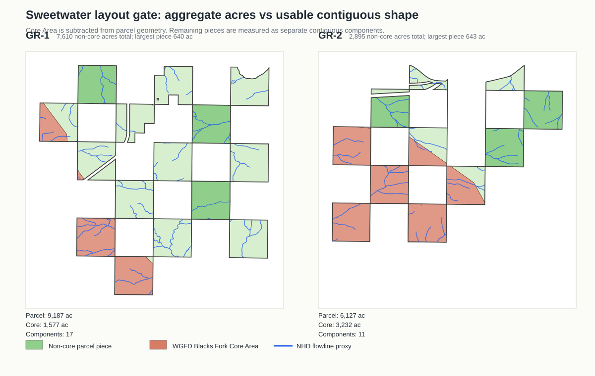
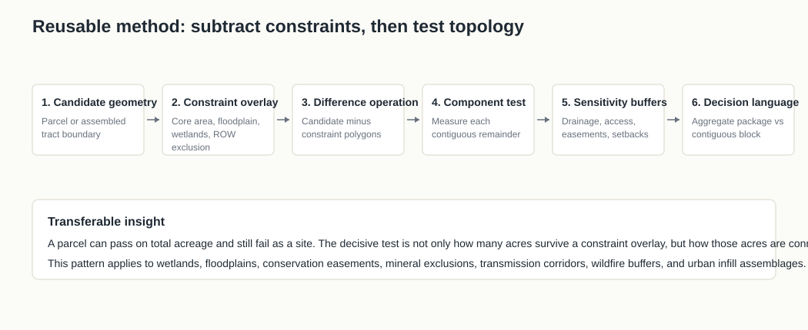
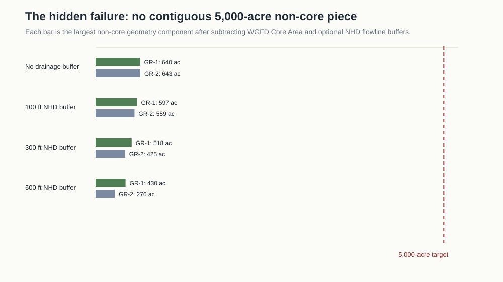

# GR-1 Layout Gate Methods Report

Date: 2026-06-21  
Subject: Sweetwater WY GR-1 / GR-2 layout gate  
Status: methods report from first-pass geometry screen, not a civil site plan

## Executive Read

The interesting result is methodological as much as site-specific:

> A parcel package can pass an acreage screen and still fail the site-shape test.

GR-1 looked strong after the first overlay pass because it had about **7,610 non-core acres** after subtracting WGFD Blacks Fork Core Area, compared with about **2,895 non-core acres** for GR-2. That was true, but incomplete. The layout gate added a topology test: split the surviving non-core acreage into contiguous geometry components and measure the largest component.

That second test changed the decision language. GR-1 is still the physical lead, but it is not a clean 5,000-acre fee-contiguous development block. It is a **controlled-section package** whose largest non-core component is only about **640 acres**. A 5,000-acre entry project remains possible only if intervening access, utility, ownership, or easement control can make those separate pieces function as one site.



## Why This Matters

The earlier county and parcel screens were asking: "Is there enough land outside the worst constraints?"

The layout gate asks a harder question:

> "Are the surviving acres connected enough to behave like a site?"

That is the transferable method. It is useful anywhere a project depends on assembling land around spatial exclusions:

- wetlands and floodplains;
- conservation easements and habitat buffers;
- mineral ownership exclusions;
- utility ROW exclusion and avoidance zones;
- wildfire, slope, or geotech buffers;
- urban infill parcel assembly;
- industrial siting around setbacks, access, and drainage.

The move is simple: do not stop at total usable acreage. After every exclusion overlay, measure the topology of what remains.



## Inputs

| Input | Source | Verification posture | Use in method |
|---|---|---|---|
| GR-1 / GR-2 parcel geometry | Sweetwater County TerraGIS parcel ownership shapefile, sourced from `https://maps.terragis.net/sweetwater/download/ownership.zip` | Official county parcel file; geometry parsed locally | Defines candidate parcel boundary |
| WGFD Core Area | WGFD Core Management Areas v4 shapefile, `https://wgfd.wyo.gov/media/2468/download` | Official WGFD shapefile; clipped locally | Defines Blacks Fork Core Area constraint |
| NHD flowlines | USGS NHD MapServer, `https://hydro.nationalmap.gov/arcgis/rest/services/nhd/MapServer` | Federal hydrography service; used as proxy only | Local drainage sensitivity, not wetland jurisdiction |
| Prior corridor overlays | `corridor-aoi-overlay-table-2026-06-20.md` | Local table from public GIS clips | Provides context: BLM, FEMA, transmission, road, rail, Green River distance |

## Method

The method has six steps.

1. **Start with candidate geometry.**  
   Use exact parcel polygons, not envelopes. For Sweetwater this meant parsing the county `ownership.zip` shapefile by parcel ID.

2. **Apply hard or layout-shaping overlays.**  
   For this gate, the decisive overlay was WGFD Blacks Fork Core Area. The method subtracts this polygon from the candidate parcel.

3. **Measure aggregate surviving acreage.**  
   This is the familiar screen. GR-1 passes this screen because it has about **7,610 non-core acres**.

4. **Measure contiguous components.**  
   This is the added method. The non-core remainder is split into separate polygons. Each polygon is measured independently. The largest surviving GR-1 component is only about **640 acres**.

5. **Run sensitivity buffers.**  
   To avoid over-trusting a clean subtraction, the test adds crude NHD flowline buffers at 100 ft, 300 ft, and 500 ft. This does not replace NWI or field hydrology. It asks whether the result collapses under a reasonable drainage-avoidance stress test.

6. **Translate the result into decision language.**  
   The output is not just "pass/fail." It distinguishes:
   - **fee-contiguous block:** one connected site that can plausibly carry the project;
   - **controlled-section package:** many pieces that may work only if access, utility, and intervening control can be solved;
   - **aggregate acreage only:** a misleading pass that should not advance to outreach.

## Results

| Gate | GR-1 | GR-2 | Decision effect |
|---|---:|---:|---|
| Exact parcel acres | 9,186.9 | 6,126.9 | GR-1 is larger |
| Core Area acres | 1,576.6 | 3,232.4 | GR-1 has far less core burden |
| Non-core acres | 7,610.3 | 2,894.5 | GR-1 passes aggregate 5,000-acre target; GR-2 does not |
| Non-core geometry components | 17 | 11 | Both are fragmented |
| Largest non-core component | 640.1 ac | 643.0 ac | Neither has a single 5,000-acre fee-contiguous non-core polygon |
| NHD flowlines inside parcel | 32.3 mi | 24.4 mi | Both need drainage/layout review |
| Non-core after 100 ft NHD buffer | 7,019.2 total / 596.7 largest component | 2,585.5 total / 559.2 largest component | GR-1 still passes aggregate only |
| Non-core after 300 ft NHD buffer | 5,850.7 total / 518.3 largest component | 2,001.0 total / 425.0 largest component | GR-1 still passes aggregate only |
| Non-core after 500 ft NHD buffer | 4,715.7 total / 430.1 largest component | 1,458.1 total / 276.1 largest component | GR-1 becomes marginal even in aggregate under a conservative drainage buffer |



## Verification

| Check | How it was verified | Result |
|---|---|---|
| Parcel geometry was not an envelope approximation | Used exact county shapefile parts keyed by PIDN | GR-1 has 18 parts; GR-2 has 14 parts |
| Core Area subtraction used official data | Used WGFD Core Management Areas v4 shapefile and clipped Blacks Fork Core to parcel polygons | Reproduces earlier core burden: GR-1 ~17.2%, GR-2 ~52.8% |
| Aggregate acreage was not accepted alone | Split non-core remainder into geometry components | Largest non-core component is ~640 ac, not 5,000 ac |
| Drainage sensitivity was separated from wetlands claims | Used USGS NHD flowlines only as a proxy and labeled limits explicitly | NWI and field delineation remain open |
| Result was cross-linked into decision files | Updated `decision-update.md`, `parcel-candidates.md`, `physical-overlays.md`, `source-log.md`, and `corridor-aoi-overlay-table-2026-06-20.md` | Main package now says "controlled-section package," not "clean 5,000-acre block" |

## What Would Change The Result

This is a first-pass geometry gate. It should change if any of the following prove true:

- title work shows the intervening pieces can be controlled by the same counterparty or through easements;
- BLM/RMP maps show intervening federal or ROW constraints are lighter or heavier than assumed;
- WGFD or consultant lek-buffer work cuts across the non-core pieces;
- NWI or field hydrology shows the NHD drainage proxy materially under- or overstates wet areas;
- a civil layout demonstrates that separated sections can function as one development phase through roads, utilities, and internal open space.

## Transferable Pattern

This method generalizes into a reusable screen:

```text
candidate polygon
-> subtract constraint polygon
-> measure total remainder
-> split remainder into contiguous components
-> compare largest component and component network to project threshold
-> stress with buffers
-> translate into decision language
```

The key is the translation step. Most site screens would have said:

> "GR-1 has 7,610 non-core acres, so it clears the 5,000-acre gate."

The topology method says:

> "GR-1 has 7,610 non-core acres in aggregate, but no single non-core component larger than about 640 acres. It may support a controlled-section package, but not yet a fee-contiguous 5,000-acre site."

That distinction is the useful export. It prevents a false green light while preserving a possible rescue path.

## Recommended Next Artifact

Create a section-level exhibit for GR-1:

```text
non-core sections
core sections
NHD flowlines
I-80 / UP rail / 230 kV line
required intervening access or easement links
ownership / title questions by section
```

The question for that exhibit is not "does GR-1 have enough acres?" It is:

> Can the separate non-core pieces be made to operate as one entry package without putting BLM exchange, RMP ROW exclusions, or Core Area disturbance caps on the critical path?

